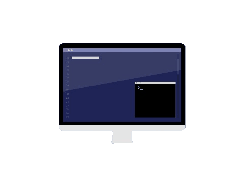
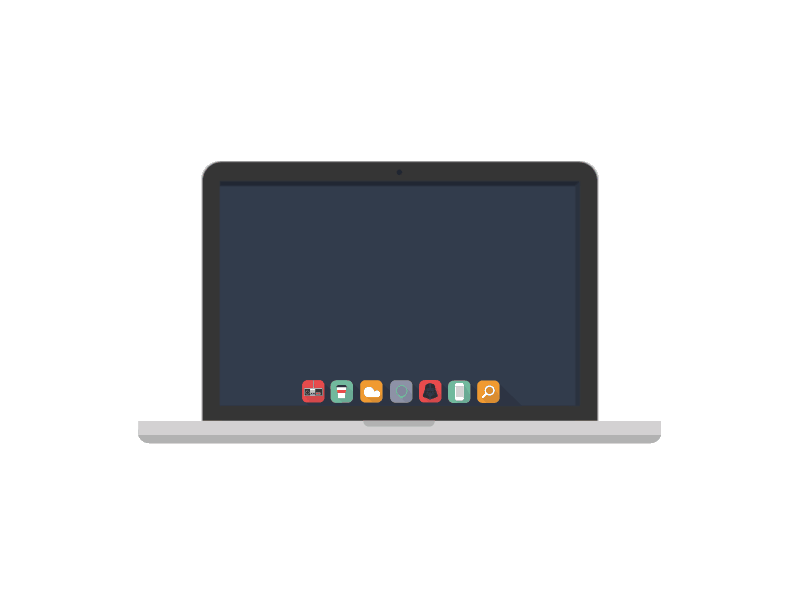
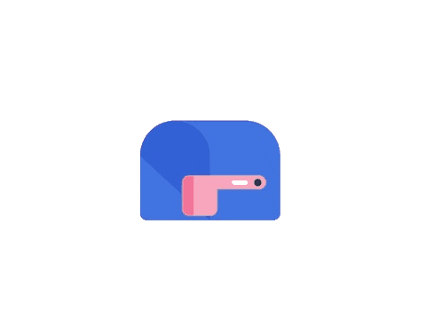

# Hi, I'm Roandre! 

 

I am currently a second year student at the University of Guelph majoring in Computer Engineering (Co-Op).  Passionate about the field and eager to learn more about Science and Technology as I continue my journey to become a computer engineer! 

## Languages 

 &nbsp&nbsp&nbsp&nbsp&nbsp
 &nbsp&nbsp&nbsp&nbsp&nbsp
 &nbsp&nbsp&nbsp&nbsp&nbsp
 &nbsp&nbsp&nbsp&nbsp&nbsp
 &nbsp&nbsp&nbsp&nbsp&nbsp
 &nbsp&nbsp&nbsp&nbsp&nbsp
 &nbsp&nbsp&nbsp&nbsp&nbsp
 &nbsp&nbsp&nbsp&nbsp&nbsp
 &nbsp&nbsp&nbsp&nbsp&nbsp

## Tools 

 &nbsp&nbsp&nbsp&nbsp&nbsp
 &nbsp&nbsp&nbsp&nbsp&nbsp
 &nbsp&nbsp&nbsp&nbsp&nbsp
 &nbsp&nbsp&nbsp&nbsp&nbsp
 &nbsp&nbsp&nbsp&nbsp&nbsp
 &nbsp&nbsp&nbsp&nbsp&nbsp
 &nbsp&nbsp&nbsp&nbsp&nbsp

 

 
<strong>What I am currently working on:</strong>

 <ul>
   <li>GUI development (Java)</li>
   <li>Front end development (HTML/CSS/JavaScript)</li>
   <li>Image rendering using ray tracing (C++)</li>
 </ul>

## GitHub Stats  

## Connect with me 

 &nbsp&nbsp&nbsp&nbsp&nbsp
 &nbsp&nbsp&nbsp&nbsp&nbsp
 

<!--
**RoandreVillegas/RoandreVillegas** is a ✨ _special_ ✨ repository because its `README.md` (this file) appears on your GitHub profile.

Here are some ideas to get you started:

- 🔭 I’m currently working on ...
- 🌱 I’m currently learning ...
- 👯 I’m looking to collaborate on ...
- 🤔 I’m looking for help with ...
- 💬 Ask me about ...
- 📫 How to reach me: ...
- 😄 Pronouns: ...
- ⚡ Fun fact: ...
-->
